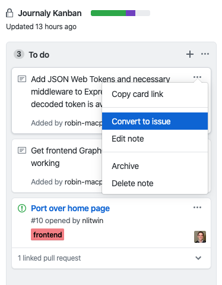

# Guide to contributing at Journaly

Welcome to the Journaly repository and thank you for being interested in contributing!
It's important for us to keep the repo in great shape and cultivate a wonderful development culture, so please read this guide before making your first contribution and feel free to refer back to it at any time :)

## The Journaly Kanban

Under "Projects", you will find the _Journaly Kanban_ where we manage our workflow. This is the central hub for all of the development work -- it's fully equipped with automation to help us seamlessly manage work as it transitions across our workflow.

### Note 📝 > Issue 💻 > Pull Request ✅ > WORLD! 🌍

That's the flow!

1. **Notes** serve as a sort of "roadmap" or "backlog" in the to-do column. This is planned work that perhaps needs some more discussion before being converted to an issue. This feature is most likely to be used by the core team to build out the roadmap before turning them into issues.

When a note is ready to become an issue, you can easily convert it to an **issue** like so:

2. **Issues** are where most contribution work will begin its life. When creating an issue, it's important to do your best to check for duplicate issues first in order to help us save time and stay efficient. Once you're ready, please follow the template and include appropriate information/context.

When an issue created, it will automatically get added to the "To Do" column of the _Journaly Kanban_.

3. **Pull Requests** are where you complete your work. We believe that a healthy Code Review culture is essential for a well-functioning team, and that starts with feeling comfortable putting up a draft PR or using the "WIP" tag in order to get feedback early and often as needed. The best work usually comes out of PRs that get multiple rounds of reviews and have plenty of healthy discussion.

- PRs are automatically tagged based on which code you edit.
- When you create a PR, please make sure to link it to an issue and it will automatically be moved to the "In Progress" column in the _Journaly Kanban_.
- If you'd like to earn the "Code Contributor" badge on journaly.com, just include a link to your profile in your PR. We'll assign you the badge once your PR merges. Feel free to reach out if this doesn't happen within a day or so.

## Milestones

We use _Milestones_ to keep track of our progress at a high level. These are simply collections of issues that work towards a common milestone or goal, such as our Beta release, first official product release, and subsequent releases and updates after that.

## Coding Guidelines

This repo uses `prettier` for formatting and `typescript-eslint` for linting TypeScript. Until precommit hooks are set up to auto format, we recommend using `prettier` on your code before submitting a PR.
You can do this by running `npm run format`

It's recommended that you also run `npm run build` before submitting your PR to ensure that the build will be clean.

If you use VS Code, install the [Prettier - Code formatter](https://marketplace.visualstudio.com/items?itemName=esbenp.prettier-vscode) extension.
