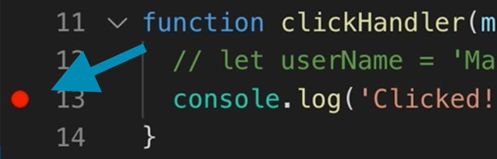

# Debugging Journaly with VS Code

You are of course welcome to debug however you like, but here's a nice little guide to help you get set up with some great debugging capabilities the way we do it on the core team.

## Configuration

1. Click on the "Debug" menu in VS Code and then "Start Debugging" (or just `f5` by default)
2. The first time you run this, it will ask you for an environment. If you're working in the browser, for example, you can click "Chrome".
3. It will now go to a `launch.json` file where you configure how to launch that. By default, we have set this up to work with running the app in the browser (port `3000`) but if you want to debug the backend in isolation, you can change the `"url"` option to have port `4000`)

Okay, you're ready to start debugging!

## Getting started!

1. Set a breakpoint by clicking in the margin on the left side of the line numbers in your editor, as shown in the screenshot:

2. Now, with the app running, go back and click on "Start Debugging" again which will start up the debugging sidebar in VS Code.
3. Simply perform whatever action you are debugging and when you hit that breakpoint, you'll be brought straight back to the editor where you can start inspecting values, stepping through, and anything else you need to debug the issue 😊
